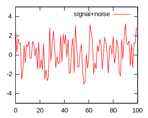
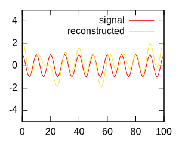
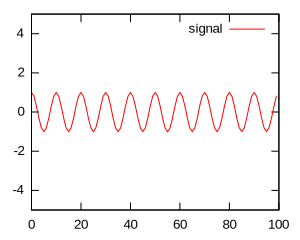
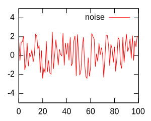
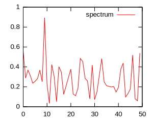
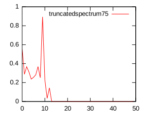

[//]: # (Comment)
[//]: # (* Copyright (C) 2016 - Ferndale-Hall)
[//]: # ( (pg_gsl@ferndale-hall.co.uk)
[//]: # ( * This file is part of pg_gsl.)
[//]: # ( * pg_gsl is free software: you can redistribute it and/or modify)
[//]: # ( * it under the terms of the GNU General Public  (License as published by)
[//]: # ( * the Free Software Foundation, either version 3 of the License, or)
[//]: # ( * (at your option) any later version.)
[//]: # ( * pg_gsl is distributed in the hope that it will be useful,)
[//]: # ( * but WITHOUT ANY WARRANTY; without even the implied warranty of)
[//]: # ( * MERCHANTABILITY or FITNESS FOR A PARTICULAR PURPOSE.  See the)
[//]: # ( * GNU General Public License for more details.)
[//]: # ( * You should have received a copy of the GNU General Public License)
[//]: # ( * along with pg_gsl.  If not, see) <http://www.gnu.org/licenses/>.)

pg_gsl 0.0.2
============

This Postgresql extension primarily provides wrapper functions for functions
from the GNU Scientific Library (GSL) http://www.gnu.org/software/gsl/.  Additional
useful functions are provided to work with the wrapper functions.

This first release provides wrappers for 2 of the GSL functions, the same
methods could be applied to many of the remaining 1900+ GSL functions.

The GSL library uses the system malloc(), free(), realloc() and calloc() functions and can be used with the pg_gsl extension.  It is also possible to modify the GSL library to use the Postgresql memory management function palloc(), pfree() and repalloc(), details on how to make these changes is given in the later section 'Using Postgresql memory management'.

Installing the GNU GSL libraries
--------------------------------

The GNU GSL libraries needs to be downloaded, built and installed, this can
be as simple as downloading from https://www.gnu.org/software/gsl/ and then:

    tar xvf gsl-latest.tar.gz
    cd gsl-2.2.1
    ./configure
    make
    sudo make install

Once built, the library libgsl.so needs to be copied to the Postgresql directory:

    cp /usr/local/lib/libgsl.so `pg_config --pkglibdir`


Installing pg_gsl
-----------------

The extension is built and installed by:

    make
    sudo make install

Once pg_gsl is installed, you can add it to a database:

    createdb pg_gsl_db
    psql pg_gsl_db
    pg_gsl_db=# CREATE EXTENSION pg_gsl;

pg_gsl functions
----------------
This first release wraps 2 of the 1900+ GSL functions:

* **pg_gsl_fft_real_transform(double precision[]) returning double precision[]**

    To return the transform of the input time series as the amplitudes of a series of sine and cosine waves.

* **pg_gsl_fft_halfcomplex_inverse(double precision[]) returning double precision[]**

    To return the re-constructed input time series from a set of sine and cosine waves

2 functions have been added to work with the retuned set of cosine and sine ways from **pg_gsl_fft_real_transform()**:

* **pg_gsl_x_fftToSpectrum(double precision[]) returning double precision[]**

  To return the normalised spectrum

* **pg_gsl_x_fftTruncate(double precision[], n integer) returning double precision[]**

  To replace the last n sine and cosine waves with zeros (filtering out the higher frequencies).

and finally a function to return the extension version:

* **pg_gsl_x_version() returns text**

Testing pg_gsl
--------------

There is a test directory with some simple tests and expected output.  By default they will use a database called "pg_gsl_db", this can be changed by setting the environment variable PG_GSL_DB.  Once the extension hsa been added the tests can be run by:
```
make pg_gsl_test
```
The tests output the difference between the actual and expected output, if the tests work there should be little or no output.

Example
-------

There is a an example that creates a "noisy" signal, performs an FFT, filters out the higher frequencies, and then reconstructs the time series. The example again uses the $PG_GSL_DB (default pg_gsl_db) and is run by:

```
make pg_gsl_example
```
The example creates and uses some extra self explanatory functions and operators, the SQL for the example is:

```
select setseed(0);
select pg_gsl_fft_halfcomplex_inverse(
  fftTruncate(
    pg_gsl_fft_real_transform(
      cosArray(100, 10, 0) + 5 * noiseArray(100)
    )
    , 75
  )
);
```

This SQL performs the inverse transform on the FFT of a noisy signal after removing the higher frequencies. The plots below show the noisy signal then both the original and reconstructed signals.

     

The script to generate these plots from the csv file generated by fftExample1.sh is in the test directory and can be executed by:
```
cd test
./fftExample1GenPlots.sh
```
The steps in the example are now described in more detail.

#### Creating the signal
The signal is created by using a test function cosArray(numberOfElement, period, offset) which generates a cosine wave:
```
select cosArray(100, 10, 0);
```
which produces the signal:



#### Creating the noise
The noise is created by using the test function noise(numberOfElement) which generates random number in the range [-0.5, 0.5]:
```
select 5 * noiseArray(100);
```
which produces the signal:



#### Creating the noisy signal
This is done by adding the 2 previous signals:
```
select cosArray(100,10,0) + 5 * noiseArray(100);
```


#### Performing the FFT
The FFT is performed on the noisy signal by invoking the GSL wrapper function pg_gsl_fft_real_transform(array):
```
select pg_gsl_fft_real_transform(cosArray(100, 10, 0)  + 5 * noiseArray(100));
```
This can be turned into a spectrum by using the function pg_gsl_x_fftToSpectrum(resultsFromFFTFunction):
```
select pg_gsl_x_fftToSpectrum(
  pg_gsl_fft_real_transform(cosArray(100, 10, 0) + 5 * noiseArray(100))
       );
```


The peak with a period of 10 is clearly visible above the noise.

#### Filtering out the higher frequencies
The higher frequencies can be filtered out using the function pg_gsl_x_fftTruncate(array, numberOfHigherFrequenciesToTruncate):
```
select pg_gsl_x_fftToSpectrum(
  pg_gsl_x_fftTruncate(
    pg_gsl_fft_real_transform(cosArray(100,10,0) + 5 * noiseArray(100)),75))
  )
);
```
 The higher frequencies have been removed.
#### Inverse transform re-creating the original signal
The truncated transform can now be used to re-create the original signal removing the high frequency noise by using the function pg_gsl_fft_halfcomplex_inverse(fftTransform):
```
select
  pg_gsl_fft_halfcomplex_inverse(
    fftTruncate(
      pg_gsl_fft_real_transform(cosArray(100, 10, 0) + 5 * noiseArray(100)), 75)
    )
  );
```


The filtered signal shown in blue, along with the original signal in red.

Using Postgresql memory management
----------------------------------
Using the Postgresql memory functions means modifying the GSL code and rebuilding libgsl.so.  This is fairly straight-forward, this section describes how I did it,  there are probably much easier ways (I would be interested in knowing what they are).

A problem is that there is no 1-to-1 mapping between all the system and Postgresql memory management functions. The system functions malloc(), free() and realloc() map directly to Postgresql functions palloc(), pfree() and repalloc().  The system calloc(size_t, size_t) functions needed a new function cpalloc(size_t, size_t).  The cpalloc() function is simply:
```
#include <postgres.h>
void *cpalloc(size_t nmemb, size_t size){
        return palloc(nmemb * size);
}
```

Further problems occur when using:
```
#define free(a) pfree(a)   (or equivalently CFLAGS += “-Dfree(a)=pfree(a)”)
```
because some GSL sections use free as a variable to hold the addresses of functions, these are also caught by the above #define cpp directives.  My solution to this was to edit the GSL src files replacing the calls to the malloc(), free(), realloc() and calloc()  with calls to MALLOC(), FREE(), REALLOC() and CALLOC() and adding the following lines to the main configuration file config.h.in:
```
#ifdef ALTERNATE_MALLOC
#define MALLOC(a)    palloc(a)
#define FREE(a)      pfree(a)
#define CALLOC(a,b)  cpalloc(a,b)
#define REALLOC(a,b) repalloc(a,b)
#else
#define MALLOC(a)    malloc(a)
#define FREE(a)      free(a)
#define CALLOC(a,b)  calloc(a,b)
#define REALLOC(a,b) realloc(a,b)
#endif
```
and reconfiguring with:
```
./configure
```
The edits in the gsl-2.1/fft directory were limited to the files c_init.c, hc_init,c and real_init.c where the functions malloc() and free() had been used.

This strategy overcame some additional problems with multiple definitions in CFLAGS and a problem trying to use #define calloc(a,b) palloc(a*b) along with the CFLAGS used by the GSL compilation.

Once the edits had been made the gsl library was recompiled with:
```
make -i CFLAGS=”-DALTERNATE_MALLOC”
```
any problems linking the test programs can be ignored, all we are interested in is the library .lib/libgsl.so which needs to be copied to the Postgresql lib directory as before:
```
cp .libs/libgsl.so `pg_config --pkglibdir`
```

Dependencies
------------

pg_gsl requires the GNU Scientific Library (GSL) which is distributed under the terms of the GNU General Public License (GPL).

The graph plotting script depends on gnuplot, http://gnuplot.sourceforge.net/

The extension was built and tested with Postgresql 9.3, GNU GSL 2.2.1 on a Linux Mint 17 (Linux Kernel 3.13.0-24-generic).

Contact Details
---------------

The author, John Pickford, can be contacted at pg_gsl@ferndale-hall.co.uk and would like to hear of any functions from the GSL library that could usefully be added to the extension.  I would also be interested to hear of any interesting signal processing problems.

Copyright and License
---------------------
pg_gsl is available under the GNU General Public License (GPL v3 or later).

Since pg_gsl is closely coupled to the GNU Scientific Library is seems reasonable that pg_gsl is available under the same GNU Public License (GPL v3),  please let me know if you feel it should be under a less restrictive license.
